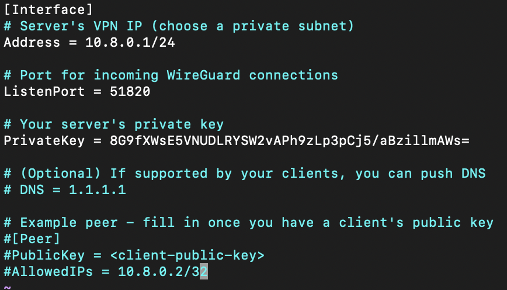
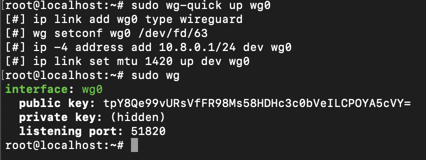
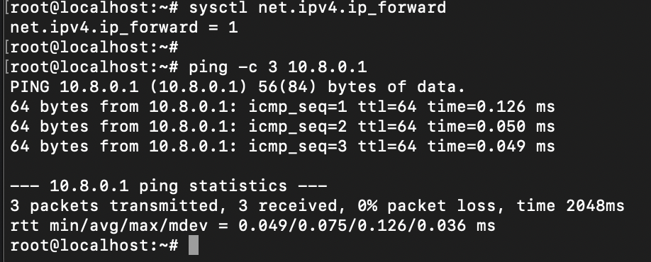

# Part 2: Configuring the Server

When you open WireGuard (on your server or client) for the first time, you’ll likely see an empty interface or a blank list of “Tunnels.” **That’s normal**—you need to create your own configuration to tell WireGuard how to handle the VPN. Below are step-by-step instructions to configure your **Linux server** as a WireGuard VPN host.

---

## Why These Steps Matter

1. **Enable IP Forwarding**  
   Allows your server to pass traffic between the VPN and other networks (like the internet).

2. **Generate Server Keys**  
   WireGuard relies on a public–private key pair. Your server has one; each client has its own.

3. **Edit `wg0.conf`**  
   This is the main WireGuard configuration file where you set the VPN interface’s IP, port, and any connected clients (peers).

4. **Add Peer Public Keys**  
   Tells the server which clients can connect by identifying them via their unique public keys.

5. **Open/Forward Firewall Ports**  
   Ensures your server can receive VPN traffic on UDP port 51820.

6. **Activate the Interface**  
   Brings the VPN “online,” making your server listen for client connections.

---

## 1. Enable IP Forwarding

1. Open `/etc/sysctl.conf`:
   ```bash
   sudo nano /etc/sysctl.conf
   ```
2. Find or add this line (make sure it’s not commented out):
   ```
   net.ipv4.ip_forward=1
   ```
3. Save and exit (in nano, **Ctrl+O** then **Enter**, then **Ctrl+X**).
4. Apply changes immediately:
   ```bash
   sudo sysctl -p
   ```
5. Confirm it worked:
   ```bash
   sysctl net.ipv4.ip_forward
   ```
   You should see:  
   ```
   net.ipv4.ip_forward = 1
   ```
   
    
   
**Why?**  
Without IP forwarding, your VPN server can’t relay traffic from connected clients to other networks.

---

## 2. Create a Secure Directory for Keys

```bash
sudo mkdir -p /etc/wireguard/keys
sudo chmod 700 /etc/wireguard/keys
```

**Why?**  
This ensures your private key is protected. `chmod 700` means only the **root user** can read or write in that directory.

---

## 3. Generate the Server’s Key Pair

1. Navigate to the keys folder and set a strict umask:
   ```bash
   cd /etc/wireguard/keys
   umask 077
   ```
2. Generate the private and public keys:
   ```bash
   wg genkey | tee server-private.key | wg pubkey > server-public.key
   ```
   
   
**Why?**  
- **Private key**: Stays secret on your server.  
- **Public key**: Shared with clients so they can encrypt data destined for this server.

---

## 4. Create the Main Configuration File (`wg0.conf`)

1. Open `/etc/wireguard/wg0.conf`:
   ```bash
   sudo nano /etc/wireguard/wg0.conf
   ```
2. Paste the following template, replacing `<server-private-key>` with the entire contents of `server-private.key`:

   ```ini
   [Interface]
   # Server's VPN IP (choose a private subnet)
   Address = 10.8.0.1/24

   # Port for incoming WireGuard connections
   ListenPort = 51820

   # Your server's private key
   PrivateKey = <server-private-key>

   # (Optional) If supported by your clients, you can push DNS
   # DNS = 1.1.1.1

   # Example peer - fill in once you have a client's public key
   #[Peer]
   #PublicKey = <client-public-key>
   #AllowedIPs = 10.8.0.2/32
   ```
3. Save and exit.
   


**Why?**  
`wg0.conf` tells WireGuard how to configure the VPN interface (`wg0`). The `[Interface]` section is for the **server**; each `[Peer]` section defines a **client**.

---

## 5. Why Add a Peer’s Public Key?

You’ll eventually create a key pair for each client. In `[Peer]` sections, you include the **client’s public key** so the server:

- Recognizes the client’s packets.  
- Encrypts data so only that client can read it.

We’ll cover this in **Part 3**, where you generate client keys and add those `[Peer]` entries to this file.

---

## 6. Open the Firewall Port (51820/UDP)

- **Ubuntu with UFW**:
  ```bash
  sudo ufw allow 51820/udp
  sudo ufw status
  ```
- **CentOS/RHEL with firewalld**:
  ```bash
  sudo firewall-cmd --add-port=51820/udp --permanent
  sudo firewall-cmd --reload
  ```
- **Other Environments**:
  - Check your router or cloud provider’s firewall settings.
  - Forward or allow UDP on port **51820** to this server.

**Why?**  
Without opening the firewall, client traffic on port 51820 can’t reach your server.

---

## 7. Start the VPN Interface

```bash
sudo wg-quick up wg0
```
Check status:
```bash
sudo wg
```
You should see something like:
```
interface: wg0
  public key: ...
  private key: (hidden)
  listening port: 51820
```


**Why?**  
`wg-quick` applies the configuration file (`wg0.conf`) to create the `wg0` network interface.

---

## 8. Enable WireGuard on Boot (Optional)

If you want the VPN to start automatically whenever the server reboots:

```bash
sudo systemctl enable wg-quick@wg0
```

**Why?**  
No need to manually bring `wg0` up after every restart.

---

## 9. Validate Everything

1. **Confirm IP Forwarding**:
   ```bash
   sysctl net.ipv4.ip_forward
   ```
   Should be `1`.
2. **Ping the VPN Interface**:
   ```bash
   ping -c 3 10.8.0.1
   ```
   You’ll see replies from the server’s own VPN IP (`10.8.0.1`).
   

No clients are connected yet, but this ensures your server’s VPN interface is up and running.

---

## What’s Next?

- Generate **client** keys and add their public keys to the server’s `[Peer]` sections. 
- **Part 3** will show you how to configure and connect your clients (e.g., Windows, macOS, mobile). 
- Once a client is configured, you’ll see it listed under `sudo wg` with a `latest handshake` timestamp when it’s connected.

---


### Final Tips

- **Keep `server-private.key` secret**; only share the **public** key.  
- **Use careful firewall rules** to avoid locking yourself out.  
- **Check logs** if something isn’t working: `sudo journalctl -u wg-quick@wg0` on many distributions.

Now you’re all set to move on to [_Configuring Clients_](part3.md) and set up your clients so they can connect to your newly configured VPN server!