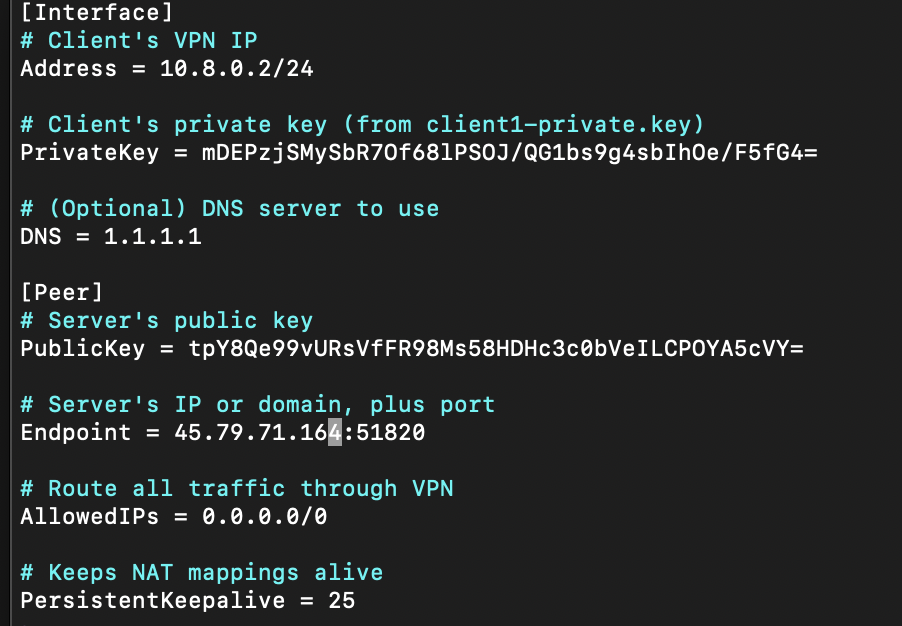
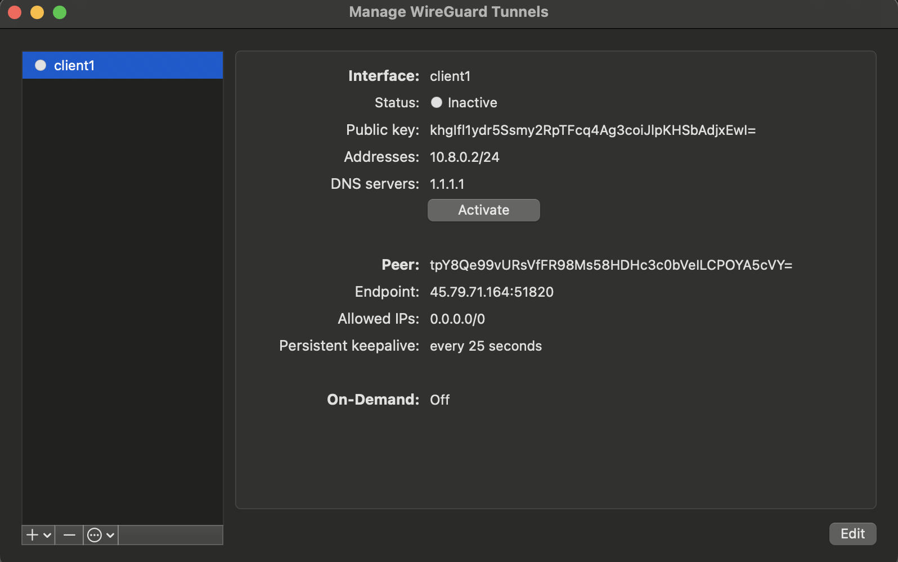
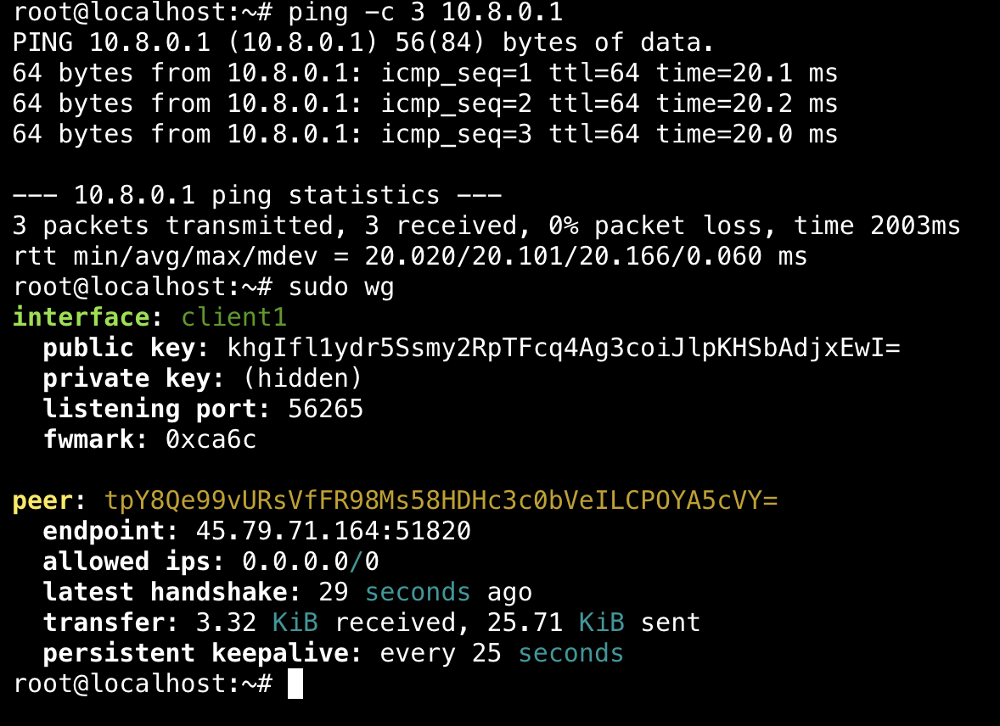

# Part 3: Configuring Clients

When you look at the WireGuard interface on a fresh install, you’ll often see an empty “Tunnels” list or a simple log window. **This guide shows you how** to create a client configuration so you can connect to your WireGuard server.

Below are **13 steps** that explain **what** you’re doing and **why** each step is necessary. We’ll also cover how to export or “download” the client configuration (`.conf` file) so you can use it on Windows, macOS, Linux, iOS, or Android.

---

## Step 1: Plan Your Client IP Addresses

```text
Pick a private IP range for your WireGuard network, e.g., 10.8.0.0/24.
Server’s IP might be 10.8.0.1/24.
Clients get 10.8.0.2/24, 10.8.0.3/24, etc.
```

### Why This Step?
Each client needs a **unique IP** in the same subnet as the server’s VPN interface. For example, if the server is `10.8.0.1/24`, the first client can be `10.8.0.2/24`, the second can be `10.8.0.3/24`, etc.

---

## Step 2: Generate the Client Key Pair

On your **Linux server** (or wherever you keep keys):

```bash
sudo mkdir -p /etc/wireguard/keys/clients
sudo chmod 700 /etc/wireguard/keys/clients
cd /etc/wireguard/keys/clients

umask 077
wg genkey | tee client1-private.key | wg pubkey > client1-public.key
```

### Why This Step?
WireGuard uses a **public–private key pair**. The **private key** stays on the client. The **public key** is added to the server’s configuration so the server recognizes and trusts this client.

---

## Step 3: Add the Client’s Public Key to the Server

Open your server configuration file, e.g. `/etc/wireguard/wg0.conf`, and **append** a new `[Peer]` section:

```ini
[Peer]
# Client 1
PublicKey = <contents-of-client1-public.key>
AllowedIPs = 10.8.0.2/32
```

Then **restart** or **update** your WireGuard interface:

```bash
sudo wg-quick down wg0 && sudo wg-quick up wg0
```
*(Or run `sudo wg set wg0 peer <client1-public-key> allowed-ips 10.8.0.2/32` for a live update.)*

### Why This Step?
The server needs to know which public key belongs to which client, and what IP to assign them (`10.8.0.2/32`). If you don’t add a `[Peer]` entry for the client, the server won’t accept its connections.

---

## Step 4: Create the Client Configuration File

Create a `client1.conf` (or any name you like) on **your server** or local machine:

```ini
[Interface]
# Client's VPN IP
Address = 10.8.0.2/24

# Client's private key (from client1-private.key)
PrivateKey = <contents-of-client1-private.key>

# (Optional) DNS server to use
DNS = 1.1.1.1

[Peer]
# Server's public key
PublicKey = <contents-of-server-public.key>

# Server's IP or domain, plus port
Endpoint = <server-ip-or-domain>:51820

# Route all traffic through VPN
AllowedIPs = 0.0.0.0/0

# Keeps NAT mappings alive
PersistentKeepalive = 25
```



!!! example "Example"

    Above screenshot shows an example of client configuration file.


### Why This Step?
Each client needs its own `.conf` file specifying:
- **Its own IP address** (`Address`).
- **Its private key** (`PrivateKey`).
- **Where to connect** (`Endpoint`) and **which server key** to trust (`PublicKey`).

---

## Step 5: Understand How to Pick the Right IP

If your server is at `10.8.0.1/24`, then:
- First client: `Address = 10.8.0.2/24`
- Second client: `Address = 10.8.0.3/24`
- Third client: `Address = 10.8.0.4/24`
  
Just make sure each client has a **different** IP in that range.

### Why This Step?
No two clients can share the same IP address. You’re essentially building a small virtual LAN (10.8.0.x).

---

## Step 6: Export (Download) the Client Config File

If you created `client1.conf` **on the server**, you need to get it onto the **client machine** (Windows, macOS, etc.):

1. **SCP (Linux/Mac)**:
   ```bash
   scp username@yourserver.com:/etc/wireguard/keys/clients/client1.conf .
   ```
   

!!! example "Example"

    The screenshot above demonstrates how to download the client configuration file using SCP.

2. **SFTP (Windows or Linux)**:
   - Open an SFTP client (like WinSCP, FileZilla).
   - Connect to your server.
   - Navigate to `/etc/wireguard/keys/clients/`.
   - **Download** `client1.conf` to your local machine.
3. **Email or Cloud Transfer**:
   - (Less secure) You could email yourself `client1.conf` or use a cloud drive—be mindful of security.

### Why This Step?
Your **client device** needs a local copy of `client1.conf` so it can import or load the config.

---

## Step 7: Import on Windows

1. **Launch WireGuard** on Windows.
2. Click **Import Tunnel(s)** (or `Add Tunnel > Import from file`).
3. Browse to `client1.conf` and click **Open**.
4. You should see a new tunnel in the list, typically named after the file.

### Why This Step?
Windows WireGuard expects a `.conf` file. Once imported, you can toggle the tunnel “on” to connect.

---

## Step 8: Import on macOS

1. **Open WireGuard** from your Applications folder.
2. Click the **+** button or “Import tunnel(s) from file.”
3. Select `client1.conf`.
4. A new tunnel appears in the list—toggle it to **Activate**.

### Why This Step?
macOS works similarly to Windows: you import the config file to create a new WireGuard tunnel.

---

## Step 9: Import on Linux (Client)

If you’re using Linux as a client:

```bash
# Place the config in /etc/wireguard/ (optional location)
sudo cp client1.conf /etc/wireguard/

# Bring up the tunnel
sudo wg-quick up /etc/wireguard/client1.conf
```

Check with:
```bash
ip addr show wg-client1
# or
sudo wg
```

### Why This Step?
Linux uses `wg-quick` to bring the VPN interface up or down. You can store `.conf` files in `/etc/wireguard/` for consistency.

---

## Step 10: Optional – Generate a QR Code for Mobile

If you have **iOS** or **Android**:

```bash
sudo apt-get install qrencode
cd /etc/wireguard/keys/clients
qrencode -t ansiutf8 < client1.conf
```
Then in the WireGuard mobile app:
1. Tap **Add**.
2. Choose **Scan from QR Code**.
3. Point your camera at the terminal output.

### Why This Step?
Scanning a QR code is often easier than manually transferring a `.conf` file to your phone.

---

## Step 11: Start (Activate) the Tunnel

- **Windows/macOS**: Toggle the tunnel to **ON** or **Activate**.
- **Linux**: `sudo wg-quick up /etc/wireguard/client1.conf`
- **iOS/Android**: Tap the “Activate” or “Connect” slider.



!!! tip "Tip"

    The above screenshot is from macOS; other types of devices offer similar operations to activate the tunnel.


### Why This Step?
This is how you **actually connect** the client to the server via the WireGuard VPN.

---

## Step 12: Verify Connectivity

1. **Ping the Server**:
   ```bash
   ping 10.8.0.1 -c 3
   ```
2. **Check IP** (if routing all traffic):
   - Visit an IP-checker site. It should show your **server’s** public IP if the tunnel is up.
3. **View “latest handshake”** on the server:
   ```bash
   sudo wg
   ```
   You should see something like:
   ```
   peer: <client1-public-key>
     endpoint: <client's IP>:<port>
     latest handshake: <recent timestamp>
   ```
   


!!! example "Example"

    The above screenshot shows a successful connection to the server through the tunnel.


### Why This Step?
Ensures your client can reach the server (`10.8.0.1`), and that traffic is flowing through the VPN.

---

## Step 13: Check Logs or Update On-The-Fly (Optional)

- **View logs**:
  ```bash
  sudo journalctl -u wg-quick@wg0
  ```
  (Adjust if your system uses a different service name.)
- **Update peer config** without restarting:
  ```bash
  sudo wg set wg0 peer <client1-public-key> allowed-ips 10.8.0.2/32
  ```
- **Disconnect** the client:
  ```bash
  sudo wg-quick down /etc/wireguard/client1.conf
  ```

### Why This Step?
- **Logs** help troubleshoot connection issues.  
- **On-the-fly updates** let you add or remove peers without fully restarting the VPN.  
- **Disconnect** safely closes the tunnel on the client side.

---


## Conclusion

By following these **13 steps**, you’ve:

1. Decided which IP address each client will use.  
2. Generated a unique key pair for every client.  
3. Added each client’s public key to the server config.  
4. Created and **exported** a `.conf` file for easy import on the client device.  
5. Activated the tunnel on your client.  
6. Verified everything is working.

**Next**: You can add more clients simply by repeating these steps (using a different `.conf` for each one). If everything’s working, you now have a fully functional WireGuard VPN setup! Now you can move to [_Starting the VPN & Connecting_](part4.md).
